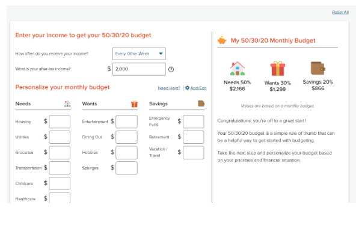

<h1>Brainstorm and Pitch Preparation
  October 21, 2022 || 09:00pm - 10:00pm || Zoom
</h1>

### Attendance 
Present:
- Krish
- Brian
- Nikhil
- Demi
- Maggie 
- Jinwoong
- Alex
- Goldie

Absent: 
- Takuro
- Rishigesh

---
### Agenda 
- Continue with brainstorming project idea
- Prepare for the project pitch

---
### Deadlines/Action Items

<ins>Monday Oct 24, 2022</ins>
- Project Brainstorm Activity (11:59)
  - Details on canvas assignment
- Deliver a project pitch to Priyanka with one to two ideas max
  - They must follow the CRUD pattern and local-first emphasis
  - Each person must deliver a part of the pitch
  - Focus on functionality first instead of design
  - More details to come in the meeting on 10/19/22

---
### Diagram
<h4>No2Broke</h4>
<h4>BudgetBuddy</h4>
<h4>Wallet Warden</h4>

Introduction: (Krish, Brian)
- What is the idea?

Create(Alex)
- Expense details: Needs, Wants, Savings
- Category of purchase
- Price of the expense
- Date
- Recurring or one-time
- Income 

Read (Goldie, Maggie)
- Display monthly/yearly breakdown (pie chart, line graph)
- Visual representation of calender/budget chart 

Update
- Change the category / price / date of the expense
- Change the 50/20/30 rule 

Delete  (Demi, Jinwoong)
- Deletes expenses that were created by mistake, refunded

Target Audience/User Stories (Krish, Brian)
- College kids - young adults - newly married couples
- Impulse spenders
- To become financially responsible (make them feel good  about doing it) 
- How do you get users to add their expenses?

