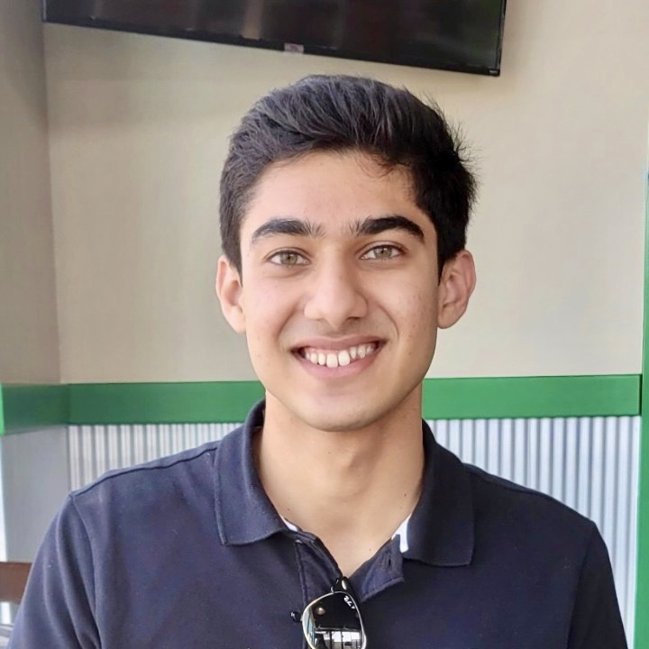
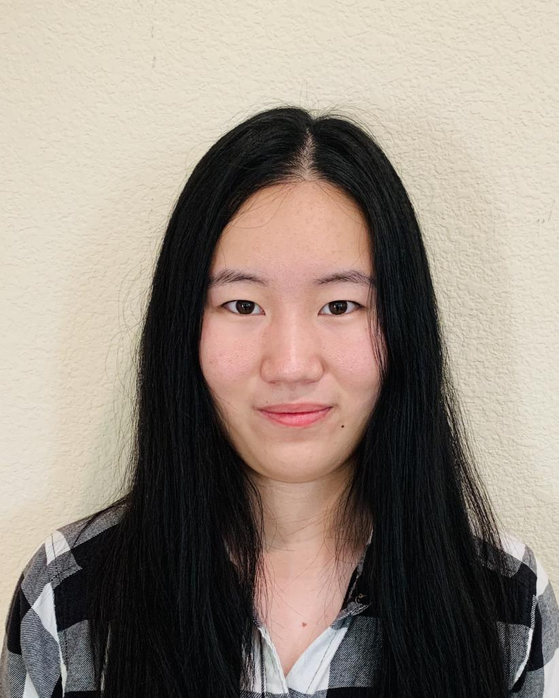
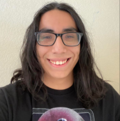
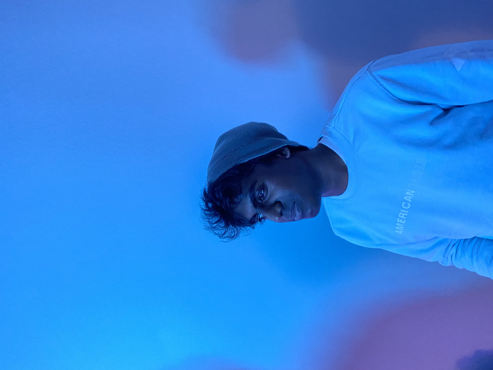

# Team 8: The Byte

Eight bits in a byte - the fundamental building block of every software program in existence. At the Byte, each bit in out team plays a pivotal role in working together towards the common goal of developing a CRUD app that incorporates local-first ideologies. Although we may come from different technical backgrounds, the sum of our own individual experiences culminates into something far greater than any single person could bring. The summation of our front-end, back-end, organizational, and development pattern knowledge immediately sets us up for success in our imminent software endeavor. 

## Our Values 
Our goal is to promote a fostering and encouraging atmosphere in our team in an attempt to build psychological safety within our group. We expect to do this by: 

- 00000001 - Focus
  - Everyone is engaged and focused on their issue at hand. Each person understands the importance of their work in the larger context of the overall project. 

- 00000010 - Commitment
  - Everyone is committed to delivering their work in a timely and efficient manner. Effort is never below a hundred percent. 

- 00000011 - Respect
  - Each team member respects their co-workers to be independent and capable individuals. They take advantage of everyone's unique technical background and experiences.    

- 00000100 - Openness
  - Failures aren't hidden and roadblocks are actively shared to leverage knowledge from the rest of the team members. 

## Meet the Bits

**Krish Dandiwala** - *Team Lead*

Socials: [Github](https://github.com/kdandiwala) / [LinkedIn](https://www.linkedin.com/in/krish-dandiwala/)

I'm a third-year computer engineering major at UC San Diego. I love listening to alternative/R&B music, playing recreational basketball, and being a big fan of the Golden State Warriors! I've interned at Nebulon Inc. as a software engineer and Cogitativo Inc. as a data engineer. At Nebulon, I implemented error-logging wrappers and metrics on 100+ GoLang functions that queried databases in the cloud. At Cogitativo, I developed an end-to-end ETL data pipeline project for 20+ sensitive medical datasets using AWS services.

---

**Goldie (Shengqiu) Jin** - *Designer*

Socials: [Github](https://github.com/sjin799) / [LinkedIn](https://www.linkedin.com/in/shengqiujin/)

 I'm a third-year computer engineering major at UC San Diego. I love to draw and watch movies and animes. I have hold 2 graphic design positions for different student organizations. I am experience in Figma and Canva for illustration/UI design and. I will be doing a software engineering co-op with Collins Aerospace for next winter and spring to develope new feature on estimating landing distance on airplane. 

---

**Alex Hernandez Perez** - *Agile Developer*

Socials: [Github](https://github.com/anh010) / [LinkedIn](https://www.linkedin.com/in/alex-hernandez-perez-843371253/)

I'm a Third-year transfer computer engineering major at UC San Diego. Some of my hobbies include reading manga, playing video games and practicing karate. Im one of the Agile devs for this team since Ive front and back end experience, which includes working with databases, and handling user data. This quarter I'm volunteeering with the ECE outreach to design and teach the fundamentals of electrical and computer engineering to K-12 students in socioeconomically disadvantaged areas around San Diego.

---

**Demi Mao** - *Agile Developer*

Socials: [Github](https://github.com/demimao) / [LinkedIn](https://www.linkedin.com/in/demi-mao-823208218/)

I'm a third-year math-cs major at UC San Diego. I love watching fantasy movies, chilling out by the sea and exploring new restaurants. I'm one of the agile devs for the team and I look forward to working collaboratively with designer, front-end and back-end devs. I'm an officer at the UCSD Chinese Engineering Society, holding events such as intern mixer and data mining competition. Next quarter, I might work as a math contents tutor at the Teaching + Learning Commons at Geisel.

---

**Rishigesh Jayananth** - *Front End Developer*

Socials: [Github](https://github.com/rjayanan) / [LinkedIn](https://www.linkedin.com/in/rishigesh-jayananth-024807243/)

 I'm a third-year computer engineering major at UC San Diego. I love to play basketball, volleyball, and watch anime. I've interned at HPE as a system validation engineer, working on various projects such as a Front End UI project as well as automating test cases. I currently still work there part time and currently working on my KCNA certification.

---